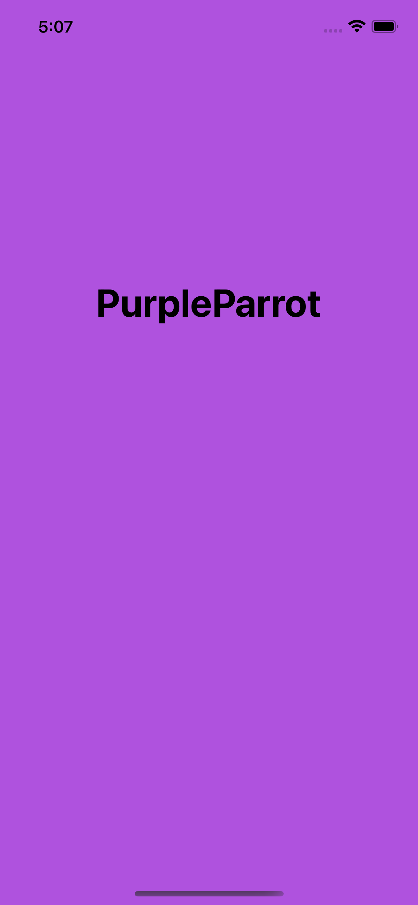
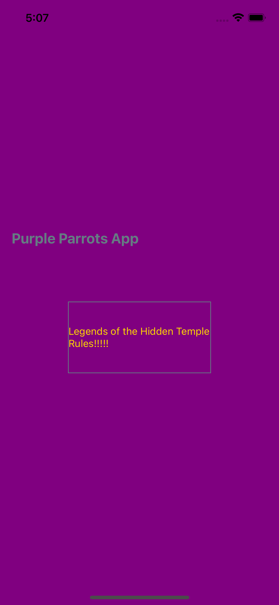
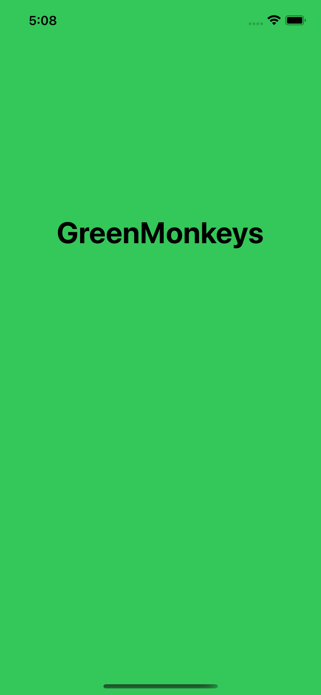
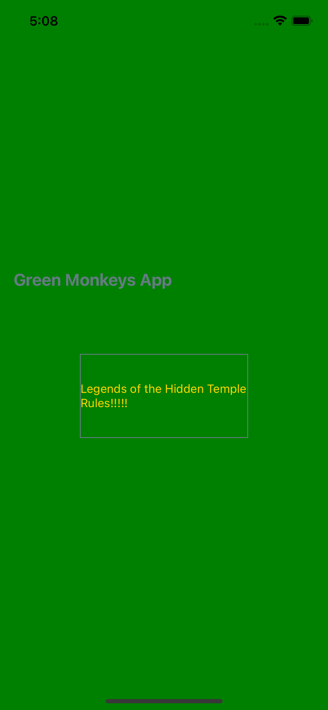

# RN Base with White Label

This prototype is a base react native app to implement White Label to show how it works on RN. This one was built looks like in [this post](https://medium.com/flawless-app-stories/react-native-white-label-101-163c1967c12a).

## Installation

```
yarn
```

### - iOS
```
cd ios
pod install
cd ..
```
>NOTE: To review the native code, open the project in Xcode


## Running on iOS
PurpleParrot app
```
npx react-native run-ios --scheme "PurpleParrots"
```
  

\
GreenMonkeys app
```
npx react-native run-ios --scheme "GreenMonkeys"
```
  