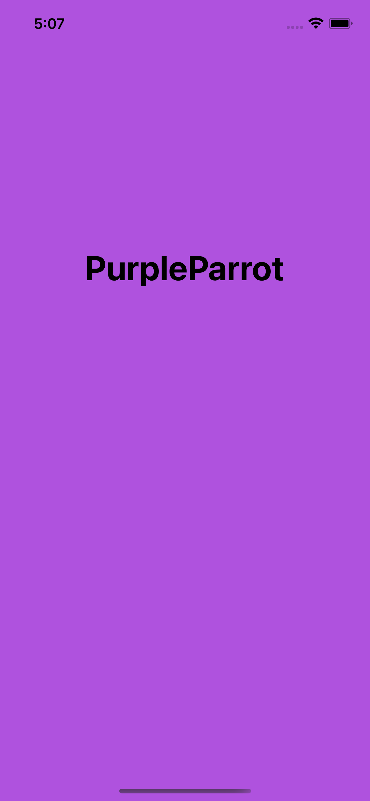
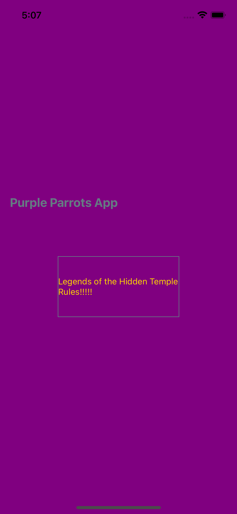
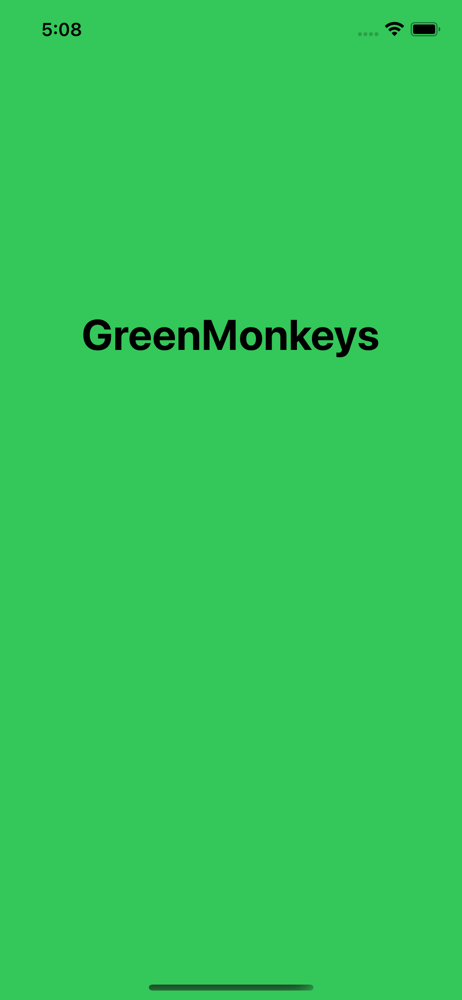
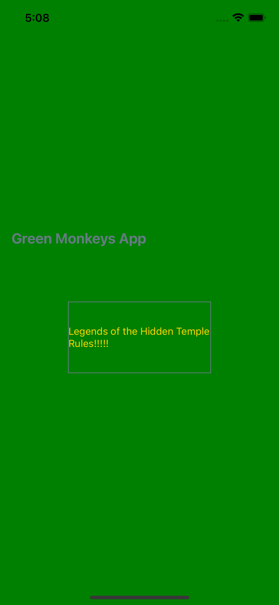
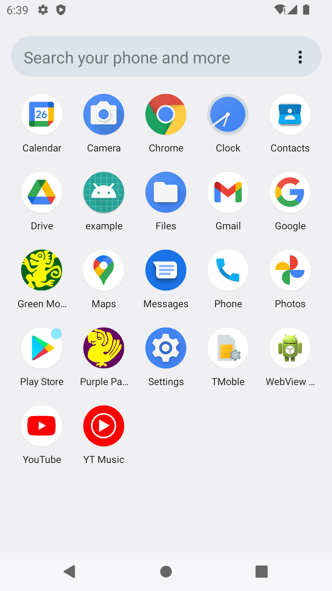
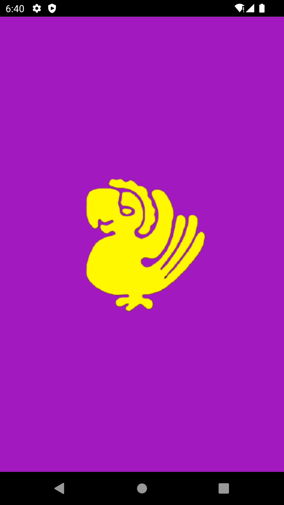
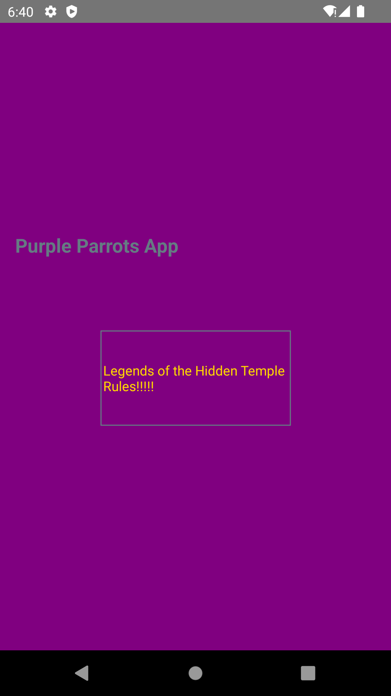
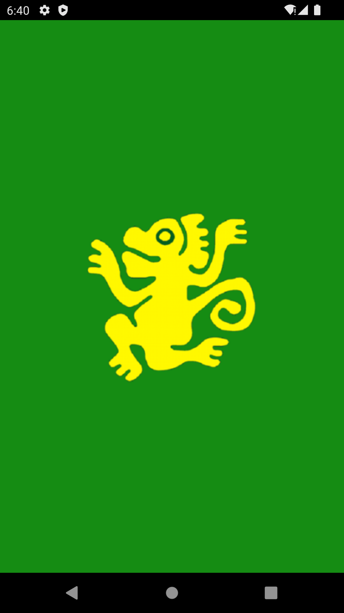
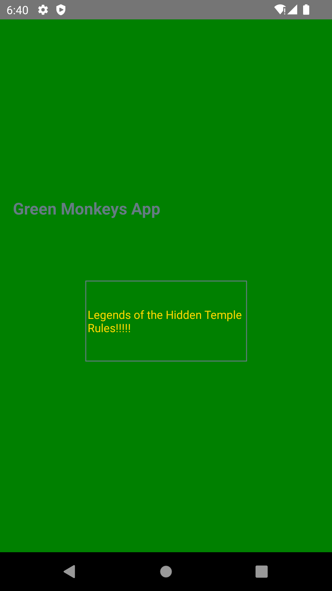

# RN Base with White Label

This prototype is a base react native app to implement White Label and a PDF Viewer to show how it works on RN. This one was built similar to the explanation in [this post](https://medium.com/flawless-app-stories/react-native-white-label-101-163c1967c12a) and following the react native doc for [android](https://reactnative.dev/docs/native-modules-android) and [ios](https://reactnative.dev/docs/native-modules-ios).

## Installation

```
yarn
```

### - iOS
```
cd ios
pod install
cd ..
```
>NOTE: To review easier the native code, open the ios directory with Xcode and android directory with Android Studio

## Running on iOS
PurpleParrot app
```
npx react-native run-ios --scheme "PurpleParrots"
```
  

\
GreenMonkeys app
```
npx react-native run-ios --scheme "GreenMonkeys"
```
  

## Running on Android
PurpleParrot app
```
npx react-native run-android --variant "purpleParrotsDebug" --appIdSuffix "purpleparrots"
```
  

\
GreenMonkeys app
```
npx react-native run-android --variant "greenMonkeysDebug" --appIdSuffix "greenmonkeys"
```
  